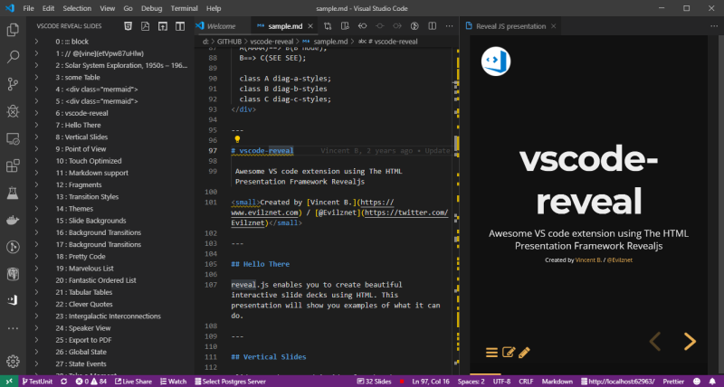

# vscode-reveal

> A Visual Studio Code plugin to write your presentation

- Based on Reveal JS
- Content first, just write markdown
- Side to side preview
- Navigate to slide directly from VS Code
- Many revealjs plugins

**[Get Started](introduction)**
[<i class="fas fa-download"></i>VS code marketplace](https://marketplace.visualstudio.com/items?itemName=evilz.vscode-reveal)

