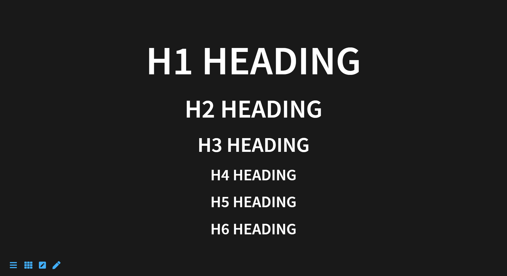
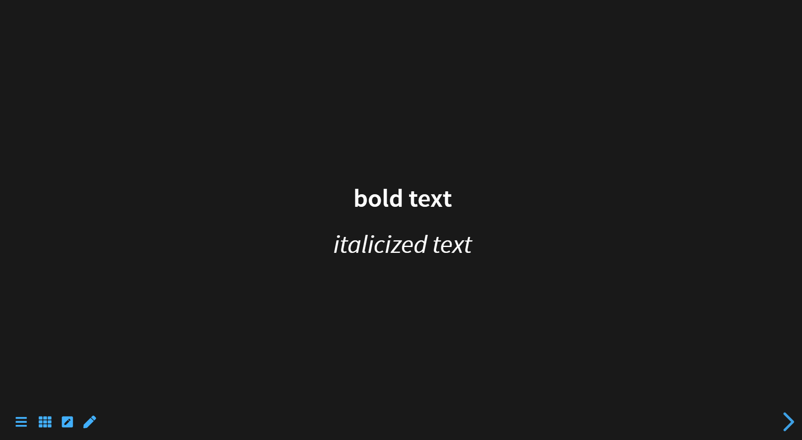
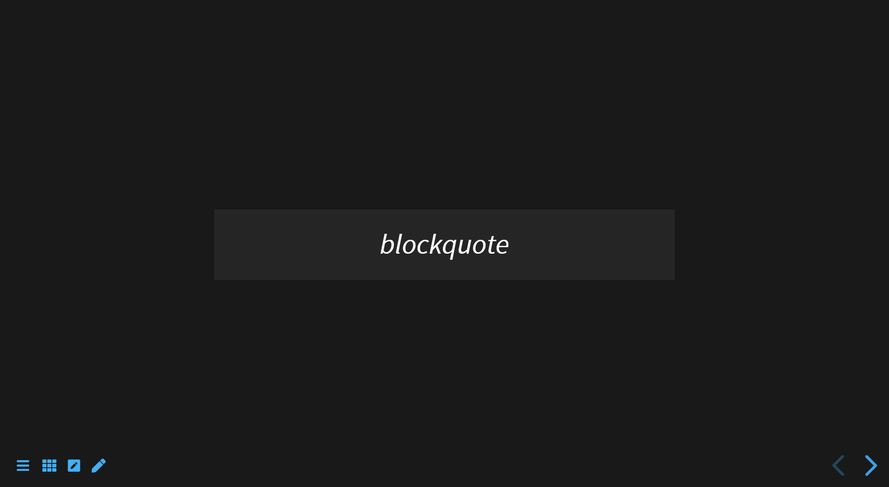
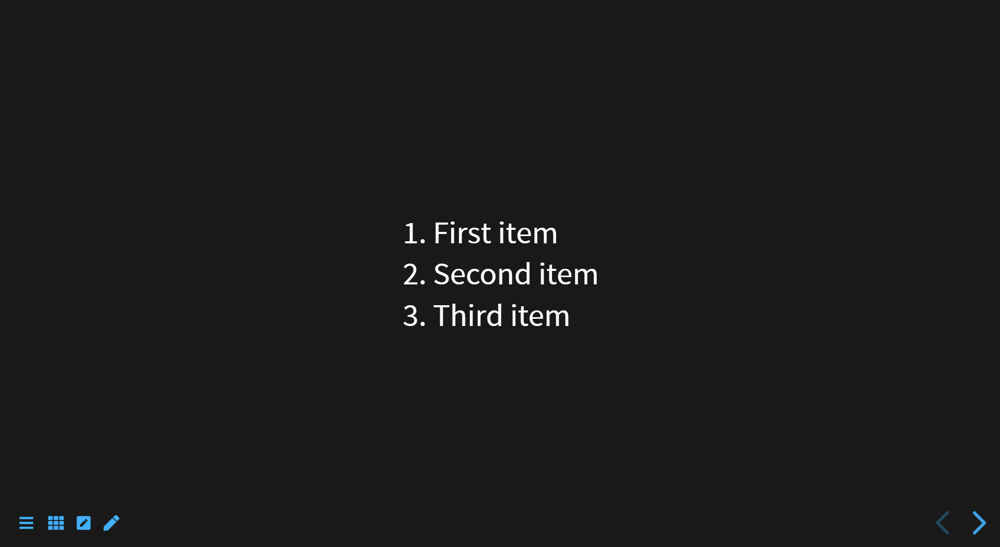
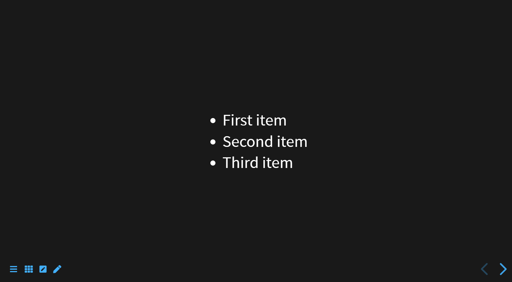
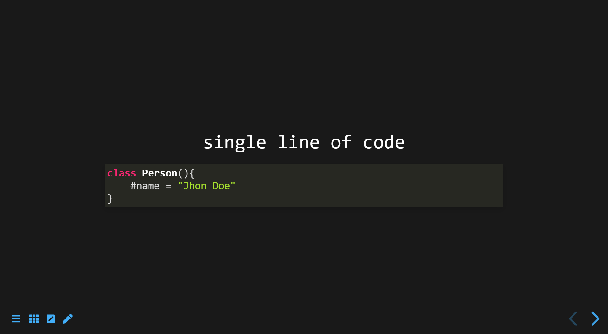
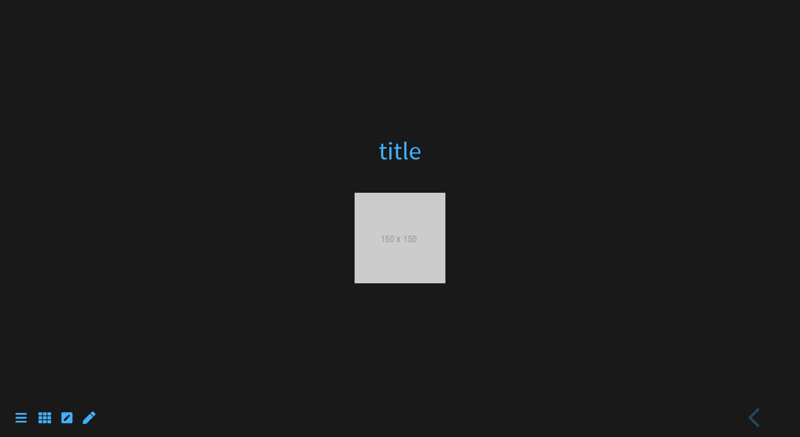

# Basic Syntax


## Heading

```markdown
# h1 Heading
## h2 Heading
### h3 Heading
#### h4 Heading
##### h5 Heading
###### h6 Heading
```



## Text style

```markdown
**bold text**
*italicized text*
```



## Blockquote

```markdown
> blockquote
```



## Ordered List

```markdown
1. First item
2. Second item
3. Third item
```



## Unordered List

```markdown
- First item
- Second item
- Third item
```


## Code

```markdown
`single line of code`
```

```markdown
    ```js
    class Person(){
        #name = "Jhon Doe"
    }
    ```

```





## Link and image

```markdown
[title](https://www.example.com)

```


