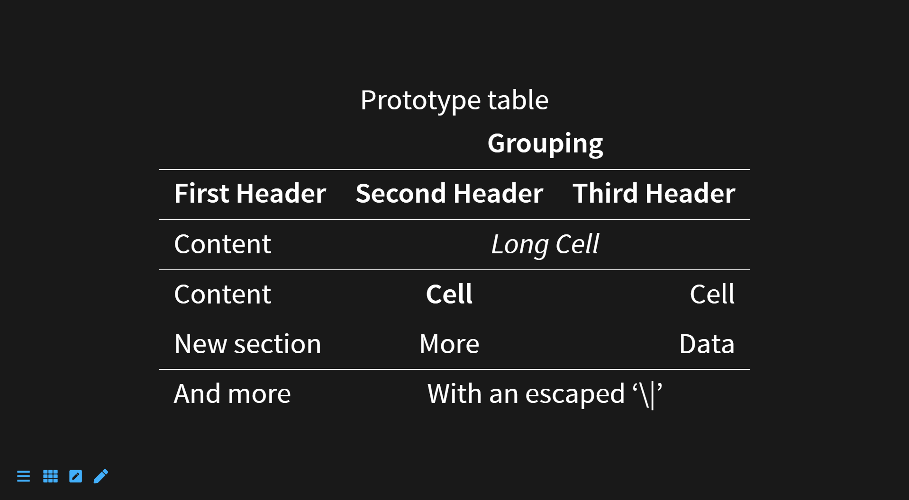
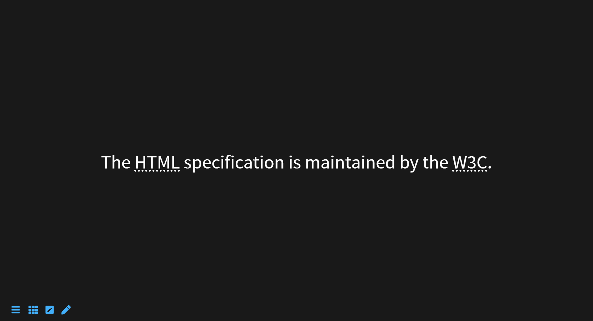
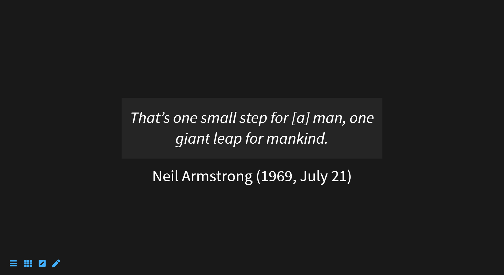
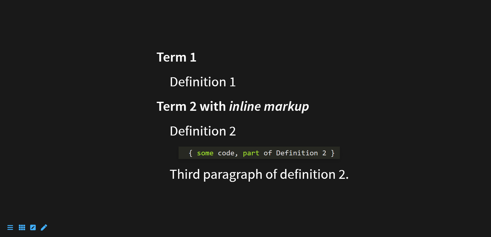
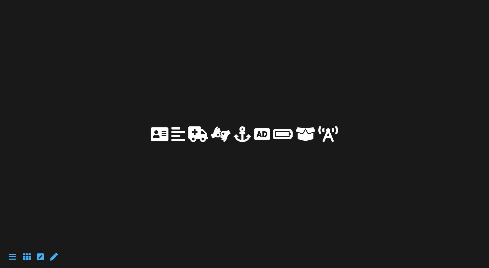
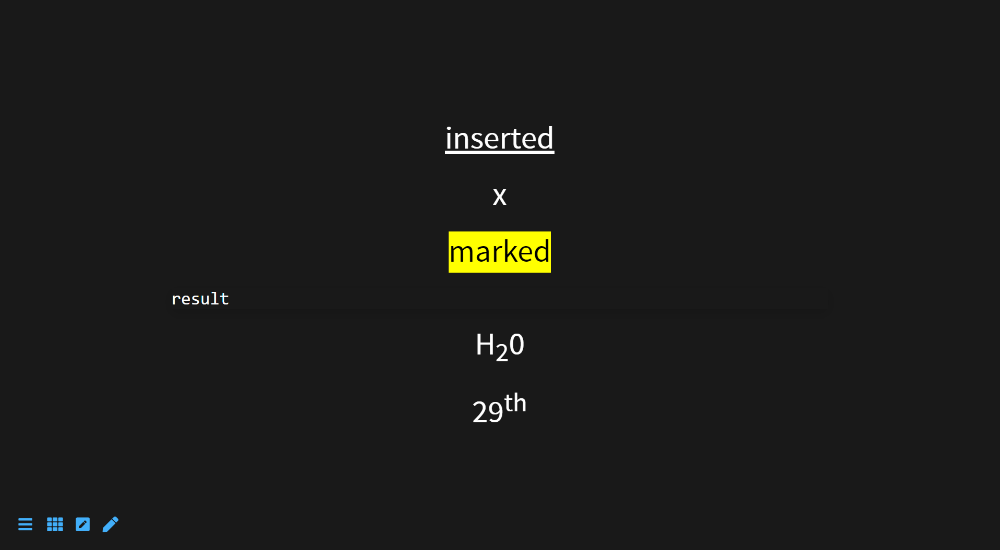
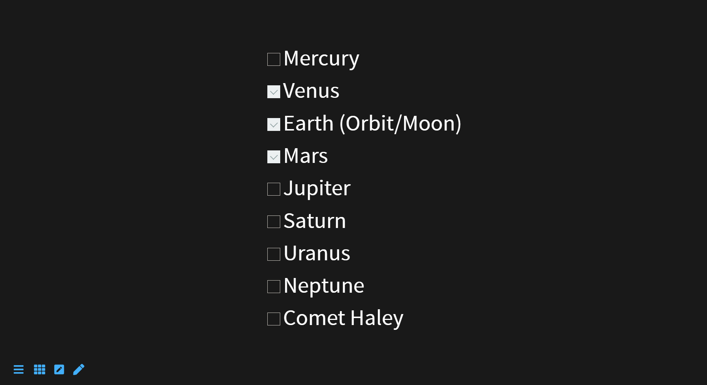

# Extended Syntax

## Table

Table use the multimd-table extension of markdown
```markdown
|             |          Grouping           ||
First Header  | Second Header | Third Header |
 ------------ | :-----------: | -----------: |
Content       |          *Long Cell*        ||
Content       |   **Cell**    |         Cell |
                                              
New section   |     More      |         Data |
And more      | With an escaped '\\|'       ||
[Prototype table]
```



## Classes, identifiers and attributes to your markdown

```markdown
# header {.some-class style="background:blue"}
paragraph {data-toggle=modal}
```


## Abbreviation

```markdown
*[HTML]: Hyper Text Markup Language
*[W3C]:  World Wide Web Consortium
The HTML specification
is maintained by the W3C.
```




## Attribution

> The plugin allows to provide an attribution for a quotation: 

```markdown
> That's one small step for [a] man, one giant leap for mankind.  
> — Neil Armstrong (1969, July 21)
```

```html
<figure class="c-blockquote">
  <blockquote>
    <p>
      That's one small step for [a] man, one giant leap for mankind.  
    </p>
  </blockquote>
  <figcaption class="c-blockquote__attribution">
    Neil Armstrong (1969, July 21)
  </figcaption>
</figure>
```



## Definition list

Syntax is based on [pandoc definition lists](https://pandoc.org/MANUAL.html#definition-lists).

```markdown
Term 1

:   Definition 1

Term 2 with *inline markup*

:   Definition 2

        { some code, part of Definition 2 }

    Third paragraph of definition 2.
```



## Font Awesome icons

```markdown
:fa-address-card:
:fa-align-left:
:fa-ambulance:
:fa-american-sign-language-interpreting:
:fa-anchor:
:fa-audio-description:
:fa-battery-full:
:fa-box-open:
:fa-broadcast-tower:
```




## Other html inline

```markdown
++inserted++

[[x]]

==marked==

´´´
result
´´´

H~2~0

29^th^
```

```html
<p><ins>inserted</ins></p>
<p><kbd>x</kbd></p>
<p><mark>marked</mark></p>
<pre><samp>result
</samp></pre>
<p>H<sub>2</sub>0</p>
<p>29<sup>th</sup></p>
```




## GitHub-style task lists


```markdown
- [ ] Mercury
- [x] Venus
- [x] Earth (Orbit/Moon)
- [x] Mars
- [ ] Jupiter
- [ ] Saturn
- [ ] Uranus
- [ ] Neptune
- [ ] Comet Haley
```




## Block

Create block divs and nest divs within each other as well.

```markdown
::: id=my-id class=blog-post
content
:::

::: #my-id .blog-post
content
:::
```

```html
<div id="my-id" class="blog-post">
<p>content</p>
</div>
```


## Iframe

```markdown
/i/https://www.youtube.com/embed/kurZDZ5jT2Y
```


