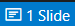

# Quick Start

Once the VS code plugin is installed, create a new markdown file.

After a short time you will see the slide counter appear on the status bar.

You can click on it to display a preview in a side tab.

It will start a webserver in background and the statusbar will display the server address and a button to stop it.

If you click on the server address it will open the presentation in your default browser.
