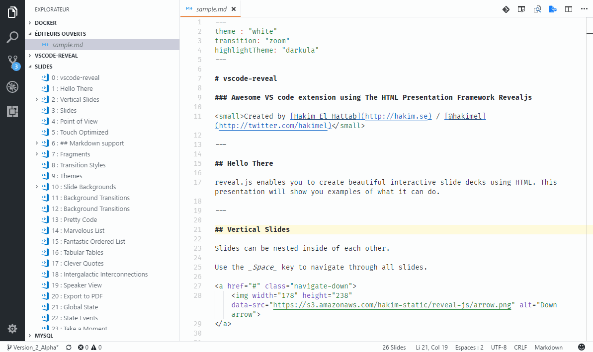

# docsify-example-panels

[](https://www.npmjs.com/package/docsify-example-panels)
[](https://github.com/docsifyjs/awesome-docsify#plugins)
[](https://app.codacy.com/app/VagnerDomingues/docsify-example-panels?utm_source=github.com&utm_medium=referral&utm_content=VagnerDomingues/docsify-example-panels&utm_campaign=Badge_Grade_Dashboard)
[](https://github.com/VagnerDomingues/docsify-example-panels/blob/master/LICENSE)
[](https://twitter.com/intent/tweet?url=https%3A%2F%2Fgithub.com%2FVagnerDomingues%2Fdocsify-example-panels&hashtags=docsify,developers,frontend,plugin,documentation)
<a class="github-button" href="https://github.com/VagnerDomingues/docsify-example-panels" data-icon="octicon-star" data-show-count="true" aria-label="Star VagnerDomingues/docsify-example-panels on GitHub">Star</a>

A [docsify.js](https://docsify.js.org) plugin for rendering example panels content from markdown.

<!-- panels:start -->

<!-- div:title-panel -->
 
 # Title
 
<!-- div:left-panel -->

If you are on widescreen, checkout the right side panels.

<!-- div:right-panel -->


This panel is a demo. but you can see more in:

-   [Fairlay API](https://fairlay.com/api)

<small>please contact me if you use docsify-example-panels. i would like to display it here too.</small>

<!-- div:title-panel -->

## Features

<!-- div:left-panel -->

**Advantages**

-   Create div panels really fast and anywhere in your .md file.
-   Choose the classnames for your divs and stylize them.
-   Use CSS custom properties to change it's structure.
-   Prefab CSS classes for "left-panel", "right-panel" and "title-panel".

**Compatibility**

-   Fully compatible with any markdown or html features:

<details>
  <summary>code snippets </summary>

```html
  <body>
    
  </body>
```

</details>

<details>
  <summary>quotes</summary>

> just a quote

?> a cooler quote...  <small> (at least i think it is)</small>

</details>

<details>
  <summary>images <small>(memorable)</small></summary>

  <br/>
  
</details>

-   Fully compatible with major docsify plugins such as:

> [docsify-themeable](https://jhildenbiddle.github.io/docsify-themeable/)
>
> [docsify-tabs](https://jhildenbiddle.github.io/docsify-tabs/)
>
> [docsify-copy-code](https://github.com/jperasmus/docsify-copy-code)
>
> [docsify-pagination](https://github.com/imyelo/docsify-pagination)

**Limitations**

-   _Nesting_ (i.e panels within panels) all pannels are rendered as siblings, Nesting only avaiable throught post-render javascript code.

<!-- div:right-panel -->

For multi-language documentation you can use it along with [docsify-tabs](https://jhildenbiddle.github.io/docsify-tabs/):

<!-- tabs:start -->

### **HTML**

```html
<!-- HTML -->
<h1>Heading</h1>
<p>This is a paragraph.</p>
```

### **JS**

```js
// JavaScript
function add(a, b) {
  return Number(a + b);
}
```

### **CSS**

```css
/* CSS */
body {
  background: white;
}
```

<!-- tabs:end -->

<!-- div:title-panel -->

## Installation

<!-- div:left-panel -->

Just add the docsify-example-panels plugin to your `HTML` after docsify and you'll be ready to go.

<!-- div:right-panel -->

```html
<!-- docsify (latest v4.x.x)-->
<script src="https://cdn.jsdelivr.net/npm/docsify@4"></script>

<!-- docsify-example-panels (latest) -->
<script src="https://cdn.jsdelivr.net/npm/docsify-example-panels"></script>
```

<!-- div:title-panel -->

## Usage

<!-- div:left-panel -->

1.  Define a panel in markdown file using `panel:start` and `panel:end` HTML comments.

    HTML comments are used to mark the start and end of a panel. The use of HTML comments prevents any markup from being displayed when markdown is rendered as HTML outside of your docsify site (e.g. Github, GitLab, etc).

<!-- div:right-panel -->

<p class='text-danger'> To avoid regex matches there's no whitespaces inside comment tag, beware when copying</p>

```markdown
<!--panels:start-->

(...) - Awesome div wrapper

<!--panels:end-->
```

<!-- div:left-panel -->

2.  Define divs within a panel in markdown file using HTML comments.

    The character sequence after double dot : will be rendered as the classname of the div content. all proceeding content will be associated with that div up to start of the next div `div:class` or end of panel `panel:end` comments.

<!-- div:right-panel -->

```markdown
<!--panels:start-->
<!--div:title-panel-->

  (...) - Awesome title

<!--div:left-panel-->

  (...) - Awesome explanation

<!--div:right-panel-->


  (...) - Awesome example

<!--panels:end-->
```

<!-- div:left-panel -->

3.  You can add a custom class aswell.

    perphaps you want something like a "floating-cat" class

<!-- div:right-panel -->

```markdown
<!--panels:start-->
<!--div:your-custom-class-->

...

<!--panels:end-->
```

<!-- div:title-panel -->

## Customization

<!-- div:left-panel -->

### Properties

They allow you to customize panels styles without rewriting any CSS rule.

<!-- div:right-panel -->

```css
:root{
    /* Document */
    --docsify-example-panels-document-width: 90%;

    /* Wrapper */
    --docsify-example-panels-wrapper-width: 100%;

    /* Standards */
    --docsify-example-panels-padding-inner : 8px 16px;
    --docsify-example-panels-padding-surroundings : 0px;

    /* Panel Left */
    --docsify-example-panels-left-panel-background : transparent;
    --docsify-example-panels-left-panel-width : 60%;

    /* Panel Right */
    --docsify-example-panels-right-panel-background : transparent;
    --docsify-example-panels-right-panel-width : 40%;

    /* Titles */
    --docsify-example-panels-title-background: transparent;
}
```

<!-- div:left-panel -->

### Custom Properties

You can change properties by adding a `<style>` tag or `<link>` reference to your `index.html` file after all other stylesheets, just remember to set the properties within a `:root` selector.

<!-- div:right-panel -->

```html
<style>
  :root {
    --docsify-example-panels-document-width: 100%; /* Remove margins */
    --docsify-example-panels-left-panel-width : 70%; /* bit more for left */
    --docsify-example-panels-right-panel-width : 30%; /* bit less for right */
  }
</style>
```

<!-- div:left-panel -->

### Custom Styles

Custom styles can be created using the classname you choosed in markdown

The main purpose of this plugin is to ease and rush the production of any markdown written documentation using the right panel as code examples.

But let's suppose you indeed wants to add a floating cat in your documentation, like i did.

<small> In case you insisted to read this in github url the cat image won't be so floating.</small>

<!-- div:floating-cat -->


<!-- div:title-panel -->

<hr>

<!-- div:left-panel -->

1.  Add this to your markdown:

<!-- div:right-panel -->

```markdown
  <!--panels:start-->
  <!--div:floating-cat-->

  

  <!--panels:end-->
```

<!-- div:left-panel -->

2.  will be rendered like this:

<!-- div:right-panel -->

```html
<div class="docsify-example-panels">
    <div class="docsify-example-panels floating-cat">
        
    </div>
</div>
```

<!-- div:left-panel -->

3.  Then you can play with css animations:

<!-- div:right-panel -->

```css
.floating-cat{
  position:absolute;
  right:  0px;
  width: 200px;
  height: 360px;
  z-index: 1000;

  -webkit-filter: drop-shadow(0px 5px 15px rgba(0,0,0,0.6));
  filter: drop-shadow(0px 5px 15px rgba(0,0,0,0.6));

  transform: translatey(0px);
  animation: float 6s ease-in-out infinite;
}
@keyframes float {
  0% {
      -webkit-filter: drop-shadow(0px 5px 5px rgba(0,0,0,0.8));
      filter: drop-shadow(0px 5px 5px rgba(0,0,0,0.6));
      transform: translatey(0px);
  }
  50% {
      box-shadow: drop-shadow(0px 25px 10px rgba(0,0,0,0.4));
      filter: drop-shadow(0px 25px 10px rgba(0,0,0,0.2));
      transform: translatey(-20px);
  }
  100% {
      box-shadow: drop-shadow(0px 5px 5px rgba(0,0,0,0.8));
      filter: drop-shadow(0px 5px 5px rgba(0,0,0,0.6));
      transform: translatey(0px);
  }
}
```

<!-- panels:end -->

## Contact & Support

-   Create a [GitHub issue](https://github.com/VagnerDomingues/docsify-example-panels/issues) for bug reports, feature requests, or questions
-   Add a ⭐️ [star on GitHub](https://github.com/VagnerDomingues/docsify-example-panels) or ❤️ [tweet](https://twitter.com/intent/tweet?url=https%3A%2F%2Fgithub.com%2FVagnerDomingues%2Fdocsify-example-panels&hashtags=docsify,developers,frontend,plugin,documentation) to support the project!

## License

This project is licensed under the [MIT license](https://github.com/VagnerDomingues/docsify-example-panels/blob/master/LICENSE).

Plugin created by [Vagner Domingues Madeira](https://github.com/VagnerDomingues/)

<!-- GitHub Buttons -->

<script async defer src="https://buttons.github.io/buttons.js"></script>
