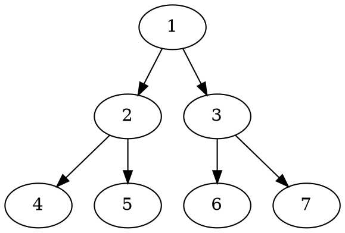

# Planuml

```plantuml
Bob -> Alice : hello
```

---

# dot



---

# ditaa

```ditaa {style=background-color:red}
    +--------+   +-------+    +-------+
    |        | --+ ditaa +--> |       |
    |  Text  |   +-------+    |diagram|
    |Document|   |!magic!|    |       |
    |     {d}|   |       |    |       |
    +---+----+   +-------+    +-------+
        :                         ^
        |       Lots of work      |
        +-------------------------+
```

---

# mermaid


