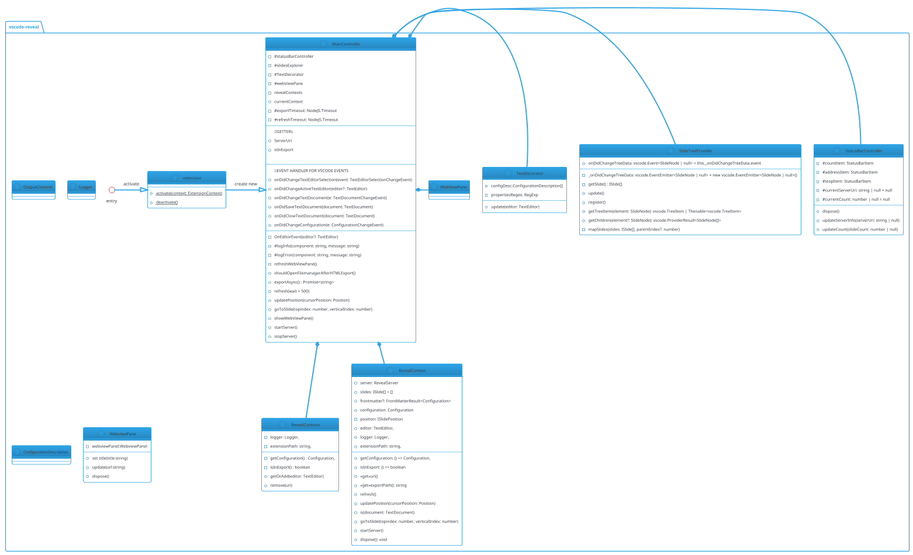

# Class diagram

---

<!--sketchy-outline-->

```plantuml
@startuml
!theme cerulean-outline
scale 1500 width

package "vscode-reveal" {
    ()  entry
    class extension{
        {static} +activate(context: ExtensionContext)
        {static} +deactivate()
    }

    class OutputChannel{}

    class Logger{}

    interface ConfigurationDescription{}

    class MainController{
        -#statusBarController
        -#slidesExplorer
        -#TextDecorator
        -#webViewPane
        -revealContexts
        +currentContext
        -#exportTimeout: NodeJS.Timeout
        -#refreshTimeout: NodeJS.Timeout
        ---
        📌GETTERs
        +ServerUri
        +isInExport

        ---
        📌EVENT HANDLER FOR VSCODE EVENTS
        +onDidChangeTextEditorSelection(event: TextEditorSelectionChangeEvent)
        +onDidChangeActiveTextEditor(editor?: TextEditor)
        +onDidChangeTextDocument(e: TextDocumentChangeEvent)
        +onDidSaveTextDocument(document: TextDocument)
        +onDidCloseTextDocument(document: TextDocument)
        +onDidChangeConfiguration(e: ConfigurationChangeEvent)
        ---
        -OnEditorEvent(editor?: TextEditor)
        -#logInfo(component: string, message: string)
        -#logError(component: string, message: string)
        -refreshWebViewPane()
        +shouldOpenFilemanagerAfterHTMLExport()
        +exportAsync() : Promise<string>
        +refresh(wait = 500)
        +updatePosition(cursorPosition: Position)
        +goToSlide(topindex: number, verticalIndex: number)
        +showWebViewPane()
        +startServer()
        +stopServer()
    }

    class RevealContexts{
          -logger: Logger,
          -getConfiguration() : Configuration,
          -extensionPath: string,
          -isInExport() : boolean
          +getOrAdd(editor: TextEditor)
          +remove(uri)
    }

    class RevealContext{
        +server: RevealServer
        +slides: ISlide[] = []
        +frontmatter?: FrontMatterResult<Configuration>
        +configuration: Configuration
        -position: ISlidePosition
        +editor: TextEditor,
        +logger: Logger,
        +getConfiguration: () => Configuration,
        +extensionPath: string,
        +isInExport: () => boolean
        +<<get>>uri()
        +<<get>>exportPath(): string
        +refresh()
        +updatePosition(cursorPosition: Position)
        +is(document: TextDocument)
        +goToSlide(topindex: number, verticalIndex: number)
        +startServer()
        +dispose(): void
    }

    class StatusBarController {
        -#countItem: StatusBarItem
        -#addressItem: StatusBarItem
        -#stopItem: StatusBarItem
        -#currentServerUri: string | null = null
        -#currentCount: number | null = null
        +dispose()
        +updateServerInfo(serverUri: string | null)
        +updateCount(slideCount: number | null)
    }

    class SlideTreeProvider{
        -_onDidChangeTreeData: vscode.EventEmitter<SlideNode | null> = new vscode.EventEmitter<SlideNode | null>()
        +onDidChangeTreeData: vscode.Event<SlideNode | null> = this._onDidChangeTreeData.event
        -getSlide() : ISlide[]
        +update()
        +register()
        +getTreeItem(element: SlideNode): vscode.TreeItem | Thenable<vscode.TreeItem>
        +getChildren(element?: SlideNode): vscode.ProviderResult<SlideNode[]>
        -mapSlides(slides: ISlide[], parentIndex?: number)
    }

    class TextDecorator{
        -configDesc:ConfigurationDescription[]
        -propertiesRegex: RegExp
        +update(editor: TextEditor)
    }

    class WebviewPane{
        -webviewPanel:WebviewPanel
        +set title(title:string) 
        +update(url:string)
        +dispose()
    }


    entry -|> extension : activate
    extension -|> MainController : create new

    MainController *-- RevealContexts
    MainController *-- RevealContext
    MainController *- StatusBarController
    MainController *- SlideTreeProvider
    MainController *- TextDecorator
MainController *- WebViewPane


}

@enduml


```