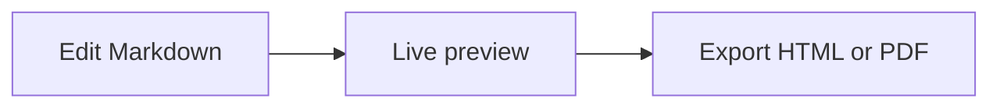
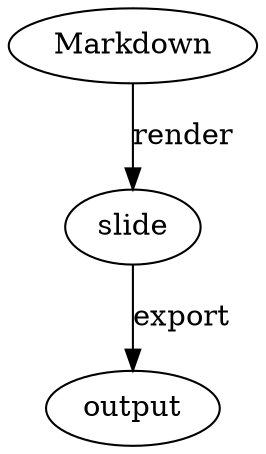

# Diagrams, math, and code

## Code

Use fenced code blocks for syntax highlighting:

```ts
const presentation = await reveal.start()
```

## Math

MathJax expressions can be used in Markdown when the relevant Reveal.js math support is available:

```markdown
$$E = mc^2$$
```

## Diagrams

VS Code Reveal renders diagram code blocks through a Kroki-compatible server. Mermaid and Graphviz/DOT are supported, along with other Kroki diagram types listed in the [front matter reference](/reference/front-matter).

### Mermaid

Use a `mermaid` fenced block. The extension sends the diagram to the `mermaid` Kroki endpoint and inserts the returned SVG into the slide:

````markdown

````

### DOT / Graphviz

Use either `dot` or `graphviz`. The `dot` alias is translated to Kroki's `graphviz` endpoint:

````markdown

````

### Requirements and troubleshooting

Diagram images are generated when the slide is rendered. The default server is `https://kroki.io`, so the VS Code host needs network access to that service. You can use another Kroki-compatible endpoint with:

```yaml
---
diagramServerEnabled: true
diagramServerUrl: https://kroki.io
---
```

You can also set the same values globally as `revealjs.diagramServerEnabled` and `revealjs.diagramServerUrl` in VS Code settings. When `diagramServerEnabled` is `false`—or when `revealjs.offline` is `true`—the fenced source remains visible as code and no SVG request is made. If a diagram appears as plain code, check those two settings and verify the configured server URL is reachable.
